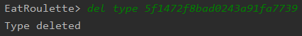

**Utilisation des plugins :** 

- Ajout de nouveau plugin : 

  - Cliquer sur le bouton "new plugin" : 

  - Retrouver le fichier Jar du plugin :

    

    

    

- Actualisation des plugins :

  

Après avoir cliquer des boutons pour lancer les plugins seront disponible :


**Espace d'administration des restaurants :** 

- Afficher tous les restaurants : 
  - Cliquer sur le button View All Restaurant :


## Application en mode CLI

L'application Java est aussi utilisable en ligne de commande. Pour cela il suffit de lancer l'application avec l'argument `-cli`. Exemple :

```sh
java - jar EatRoulette-admin-<VERSION> -cli
```

Ce mode offre des fonctionalités *"super-admin"* qui sont notament la supression de restaurant, de types, d'allergènes ou encore de caractéristiques.


### Commandes disponibles

Les commandes disponibles sont les suivantes :

```
EatRoulette-cli commands ...
*	add [restaurant | type | allergen | characteristic] [data]
*	upd [type | allergen | characteristic] id [data]
*	dell [restaurant | type | allergen | characteristic] id
*	run [plugin-name]
*	show [restaurants | types | allergens | characteristics | plugins]
*	help #To get this panel
*	exit #To quit the application
```

Vous pouvez entrer à  tout moment la commande `help` pour avoir ces informations.


Les commandes `add` permettent d'ajouter des restaurants, des types, des allergènes ou encore des caractéristiques. Exemple pour ajouter un nouveau type de restaurant:

```
add type NomDeType
```

Une fois ajouté, nous avons un retour nous confirmant l'ajout:


Les commandes `upd` permettent de mettre à jour des types, des allergènes ou encore des caractéristiques. Exemple pour mettre à jour un type :

```
upd type <ID_TYPE> NouveauNom
```

Une fois mis à jour, nous avons la confirmation:


Les commandes `del` permettent de supprimer des restaurants, des types, des allergènes ou encore des caractéristiques. Exemple supprimer un type :

```
del type <ID_TYPE>
```

Une fois mis à jour, nous avons la confirmation:




La commande `run` permet e lancer les plugins. Il est necessaire de la coupler à la commande `show plugins` pour connaitre le nom des différents plugins exécutables:


La commande `show` permet de d'afficher les restaurants, les types, les allergènes, les caractéristiques ou encore les plugins. Example d'affichage des types :


En cas de command invalid un message vous avertis que la saisie est incorrect :

