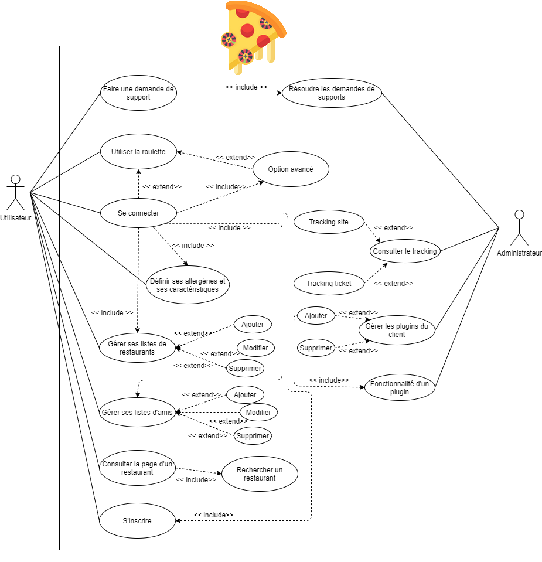

# Documentation fonctionnelle

## Descriptif de l'application

EatRoulette est une application permettant à ses utilisateurs de choisir des restaurants, dans leurs listes de restaurants préférés afin de les aider à faire le choix de leur lieux de restauration.

Grâce à un aspect social, vous pouvez inviter vos amis à déjeuner et choisir au hasard dans vos restaurants favoris le lieux idéal. Le restaurant choisis respectera l'ensemble des préférences de vos amis.

## Fonctionnalités de l'application

##### Fonctionnalités utilisateur - Client Web

| Fonctionnalités                           | Détails                                                      |
| :---------------------------------------- | ------------------------------------------------------------ |
| Roulette                                  | La roulette est la fonctionnalité permettant de proposer aléatoirement un restaurant (connecté ou non). |
| Inscription à EatRoulette                 | Lors de l'inscription un compte sera créer à l'utilisateur, lui accordant les fonctionnalités supplémentaires liés à un compte ( Création de listes de restaurants favoris, Dîner entre amis ... ). |
| Filtrer les restaurants                   | L'utilisateur pourra spécifier sa recherche à l'aide de filtres (Régime alimentaire, Type de restaurant, Proximité du restaurant). |
| Création de liste des restaurants favoris | Un utilisateur pourra créer une liste avec un titre dans lequel il pourra y ajouter ses restaurants préférer. Il aura la possibilité d'inviter des amis à collaborer à cette liste. |
| Ajout d'un restaurant dans une liste      | Pour ajouter un restaurant dans une liste, l'utilisateur devra le rechercher par son nom et son adresse. Si le restaurant n'existe pas, il à la possibilité de le créer. |
| Renseigner un restaurant                  | Si le restaurant n'existe pas déjà sur EatRoulette, un utilisateur connecté aura la possibilité de le créer en renseignant le nom et l'adresse du restaurant. Sa création entrainera automatiquement l'ouverture d'un ticket à valider. |
| Définir sa situation                      | Un utilisateur connecté pourra renseigner sa situation, ses allergènes, s'il y est en situation de handicap ou encore son régime alimentaire. |
| Groupe ami                                | Les utilisateurs connectés pourront créer des groupes et inviter leurs amis EatRoulette. |
| Roulette groupé                           | Les utilisateurs connectés pourront tirer au sort un restaurant parmi leurs listes de favoris. |
| Descriptif d'un plat                      | Certain plat pourront être décrit avec l'histoire du plat. Ces descriptions seront récupérées sur d'autres sites. |
| Envoie de Ticket                          | L'utilisateur pourra envoyer des tickets expliquant le problème rencontré au support |
| Mon historique                            | Un utilisateur connecté pourra consulté la liste des restaurant qu'il est allé visité via la roulette quand il l'aura choisi via le bouton "Valider" après la roulette. |

##### Fonctionnalités administrateur - Client Lourd

| Fonctionnalités                   | Détails                                                      |
| :-------------------------------- | ------------------------------------------------------------ |
| Consulter le tracking utilisateur | L'administrateur à la possibilité de visionner le tracking réaliser par l'application. En le consultant, il à la possibilité de filtrer (par localisation, type de restaurant...) et de construire le reporting qu'il souhaite. |
| Consulter le tracking des tickets | L'administrateur à la possibilité de visionner le tracking sur les tickets réaliser par l'application. En le consultant, il à la possibilité de filtrer (par état, type de demande...) et de construire le reporting qu'il souhaite. |
| Gérer les plugins                 | Via  cette fonctionnalité, l'administrateur à la possibilité d'ajouter ou supprimer au client lourd différents plugins. |
| Gérer les demandes utilisateurs   | Permet de gérer les différentes demandes des utilisateurs via les tickets. Il peut requalifier les demandes (Bogue, demande...), changer le statut (En cours, Résolue...), les commenter afin de lui donner un feedback. |

## Use case

Ci-dessous le diagrammes des cas d'utilisation :

*Diagramme des cas d'utilisations*

---

© EatRouletteDev-2020
