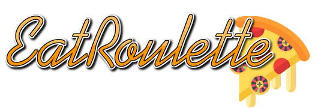

# Documentation technique

## Index

[TOC]

## Architecture logicielle

Schéma de l'architecture logicielle global du projet. Cette dernière s'articule autour d'une API NodeJs qui va interagir avec les deux applications front grâce au endpoints mise à disposition.

*Schéma de l'architecture logicielle*

## Modèles de données

### Diagramme ER

*Diagramme entité relation.*

### MCD

